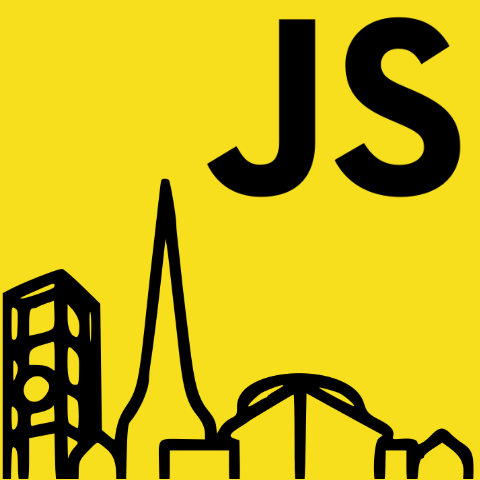

# aarhus

BeerJS Aarhus is a monthly meetup for JS folks in Aarhus. Who like beer. Sound familiar?

## How to join

Click the  button for this repo to get notified of future meetups.

## How to help

File a ticket for suggestions or issues, submit a PR for updates to this wiki.

## Slack

Sure. BeerJS has a Slack channel and there is a channel for #albuquerque. [Join](https://beerjs-slack-invite.herokuapp.com/) it here if you don't have enough Slack channels in your life.

## Why GitHub?

* If you're doing cool stuff with JS, you're probably on GitHub anyway
* GitHub is free, Meetup costs money
* Why not?

## Organizers

* Damon Toal-Rossi [GitHub](https://github.com/orbiteleven) / [Twitter](https://twitter.com/orbiteleven)
* Dmitry Manannikov [Github](https://github.com/slonoed)
